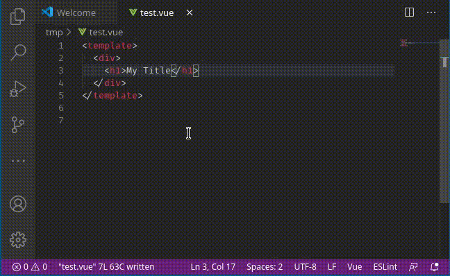

# i18nGrabber README

Helps replace text in the template with [vue i18n](https://kazupon.github.io/vue-i18n/) translation strings.

***

I usually write vue templates containing the actual texts instead of the
i18n replacement strings, because latter would break my flow. When I'm done
editing the template I need to replace all the texts with the i18n code
(`{{ $t('i18n.placeholder') }}`), which is a bit tedious. This plugin helps 
doing that by replacing the selected text with a prompted placeholder and then
puts the placeholder together with the text into the locale file.

## Features

Replacing text with a placeholder and putting it into the translation files



The dot notated strings will be split into the the nested object format:

```json
{
    "global": {
        "title": "My Title"
    }
}
```

## Extension Settings

This extension contributes the following settings:

* `i18nGrabber.translationFileLocation`: Configure the path to the default translation file, e.g. `src/locales/en.json`
* `i18nGrabber.replaceTemplate`: Configure the replace template. Default is `{{ $t("<placeholder>") }}` where `<placeholder>` is being replaced by the string 


## Release Notes

### 0.0.1

Initial release